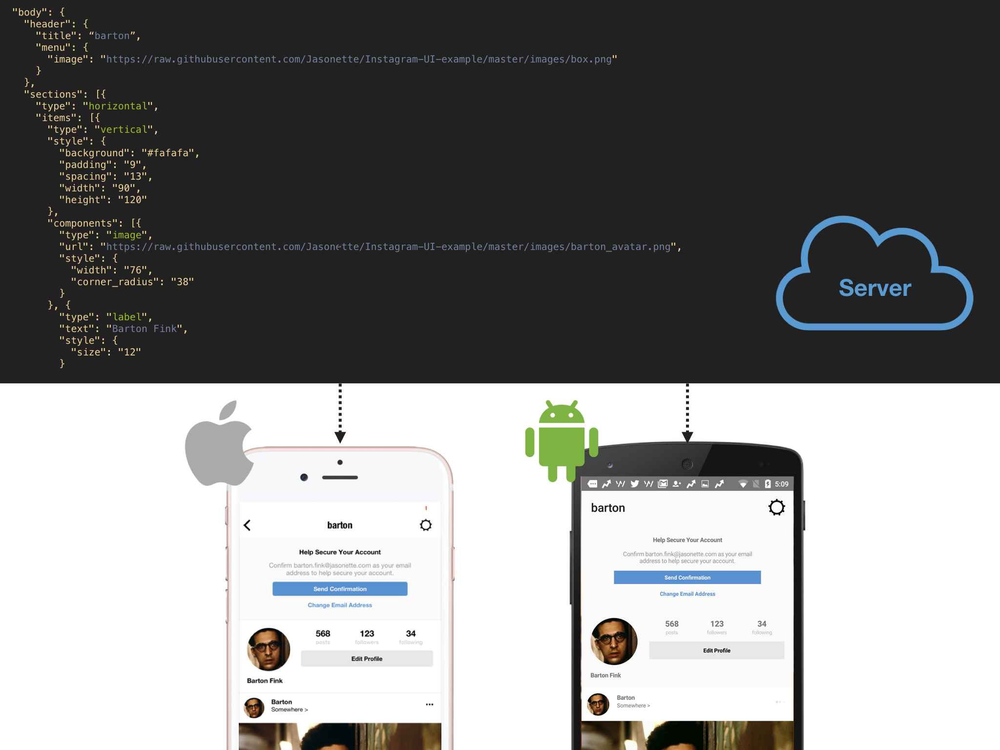
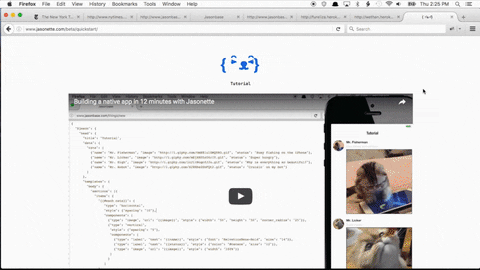

# Welcome to Jasonelle

*Jasonelle* is quite a different way to make an app. Make iOS and Android apps 
with just a single JSON, loaded over HTTP, local file, or anywhere.

It has never been trivial to have an idea and turn it into an app quickly. 
Even for *genius* programmers.

With *Jasonelle*, you don't even have to be a programmer. 
Anyone can make an app. And do it in minutes, not days or weeks.

**Make an app as fast as it takes to write a blog post**.


## Create Native Apps with JSON

Directly manipulate native APIs simply using JSON.

For *Android*, this means direct access to LinearLayout, RecyclerView, etc.
For *iOS*, this means direct access to UITableView, UIStackView, etc.



### Why JSON?

- Powerful and unified language. JSON is an industry standard today. Computers can understand it and humans too!. You can always use transpilers like *hjson*, *json5* and others to ease development.

- Learn and implement faster. Save time and deliver more results.

- Huge Ecosystem. Nearly every software supports JSON. Finding professionals and creating tools that understands JSON can be a piece of cake!.

- Want to make changes to your LIVE app?. Simply change your JSON content on the server, and watch the app change in front of your eyes, instantly!.


### How?

By using a JSON browser that builds native components.
Just like how web browsers turn HTML into a web page,
*Jasonelle* turns JSON into iOS and Android native components.
This lets you build native apps by writing a simple JSON.

1. Direct access to the device such as camera, audio, geolocation, video, network request, etc.
2. Powerful layout engine that directly manipulates native components such as UITableView, UIStackView, UIView, etc.
3. Describe styling and event handling all with JSON.


*Jasonelle* abstracts away all low level programming with a JSON based markup.
**All you need to write is a single JSON**.

#### Layout

Construct complex layouts with JSON.

##### Example: Build a card UI with an image, labels, and nested layouts
```json
{
  "type": "horizontal",
  "components": [
    { "type": "image", "url": "https://pbs.twimg.com/profile_images/557061751150112768/eMwi4Xz2.jpeg" },
    { "type": "vertical",
      "components": [
        { "type": "label", "text": "Ethan" },
        { "type": "label", "text" "www.textethan.com" }
      ]
    }
  ]
}
```

#### Action

Describe actions with JSON.

##### Example: Make a network request and draw the result

```json
{
  "type": "$network.request",
  "options": {
    "url": "http://api.giphy.com/v1/gifs/search",
    "data": { "q": "kitten", "api_key": "dc6zaTOxFJmzC" }
  },
  "success": {
    "type": "$render"
  }
}
```

#### Style
Style components with JSON

##### Example: Style a label

```json
{
  "type": "label",
  "text": "Hello World",
  "style": {
    "padding": "10",
    "corner_radius": "5",
    "background": "rgba(0,0,0,0.4)",
    "color": "#ffffff",
    "font": "HelveticaNeue"
  }
}
```

### Example: hello.json

<iframe width="100%" height="500" src="https://www.youtube.com/embed/hfevBAAfCMQ" frameborder="0" allow="accelerometer; autoplay; encrypted-media; gyroscope; picture-in-picture" allowfullscreen></iframe>

```json

{
    "$jason": {
        "head": {
            "title": "{ ˃̵̑ᴥ˂̵̑}"
        },
        "body": {
            "style": {
                "background": "#ffffff",
                "border": "none"
            },
            "sections": [
                {
                    "items": [
                        {
                            "type": "vertical",
                            "style": {
                                "padding": 30,
                                "spacing": 20,
                                "align": "center"
                            },
                            "components": [
                                {
                                    "type": "label",
                                    "text": "It's ALIVE!",
                                    "style": {
                                        "align": "center",
                                        "font": "Courier-Bold",
                                        "size": 26
                                    }
                                }
                            ]
                        }
                    ]
                }
            ]
        }
    }
}
```

### Features

#### 100% Free

Everything is free for you to use. There is no small print that says "pay $$$ if you want to publish your app". It's all yours.

#### 100% Libre
*Jasonelle* is licensed under [MPL 2 License](https://www.mozilla.org/en-US/MPL/2.0/FAQ/). Take the code, build and publish your own apps, and do whatever you want with it!


#### 100% Portable
There is no magical backend server you need to learn to use, pay for, or install to use *Jasonelle*. ALL YOU NEED IS JSON. If you have a web server, you ALREADY have a *Jasonelle* server.


#### 100% Extensible
*Jasonelle* is essentially just an engine that maps JSON expression to native components and actions. It doesn't force you to drop everything and adopt the technology exclusively. You can extend it or even integrate it with your existing native code seamlessly.


###  Quick Start

*Jasonelle* is an already "pre-cooked" app, which means "getting started" means simply downloading and running the app. All you need to do:

1. [Download](https://github.com/jasonelle/jasonelle/releases)
2. Connect your phone
3. Press play

Going from download to an actual app on your phone is so simple that it fits into a single animated gif. Watch below.



Once you have it running,
simply switch out the url to play your own JSON.

You can also watch this simple tutorial to get started.

<iframe width="100%" height="500" src="https://www.youtube.com/embed/S7yGejKIH6Q" frameborder="0" allow="accelerometer; autoplay; encrypted-media; gyroscope; picture-in-picture" allowfullscreen></iframe>

### Download

All the releases are made in the *Jasonelle/Jasonelle* repository. [Download it here](https://github.com/jasonelle/jasonelle/releases).


## Community
Engage in the welcoming and friendly community of *Jasonelle* folks!.

### GitHub
All *Jasonelle* code is in the [Github Organization](https://github.com/jasonelle).

### Slack 
*Slack* is the legacy chat, not much activity here. [You can access it here](https://jasonette.now.sh/). But *Telegram* is preferred.

### Telegram
The preferred way to contact developers and friends of *Jasonelle*. [t.me/jasonelle](https://t.me/jasonelle).

### Blog
Stay informed about the latest news about *Jasonelle*, [in the blog](https://jasonelle.com/blog).

## Documentation

*Jasonelle* is well documented with plenty of examples, tutorials and snippets.

### Docs

General documentation index and small information about the project and it´s history.
https://jasonelle.com/docs


### Legacy

These documents are still mostly valid. They are simply legacy because they are
not updated anymore. The information will slowly be transferred to the new 
documentation tools.

https://jasonelle.com/docs/legacy

### Examples
Plenty of example apps and code. (Work in Progress).

### API

How to use every component using JSON. (Work in Progress).

### Developer Notes

Engine inner workings and useful documentation for power users. (Work in Progress).

### Tutorials, Articles and Snippets

Elaborate documents with tips, tricks and howto make different apps using *Jasonelle*.
(Work in Progress).

## In Loving Memory of Ethan

We are greatly in debt with the original author of *Jasonette*, Ethan, who dissapeared
in June 2018. See more details in the [history page](https://jasonelle.com/docs/#/history).